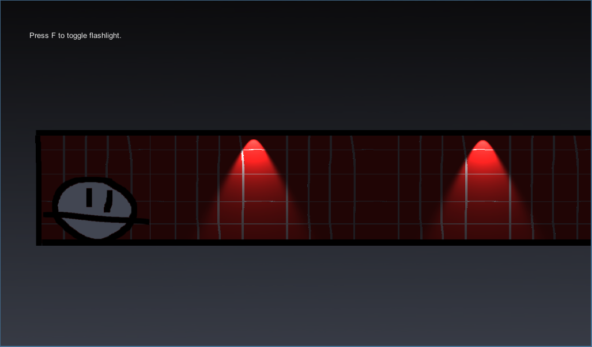

# game-a-week-three
by [@JonRaem](https://twitter.com/JonRaem/)

<h2> Background </h2>

 Back in the autumn of 2014 I decided to start a Game A Week project to improve my skills in game development. What is a Game A Week, you ask? It's pretty self explanatory: you have to make a game in a week and release it on the last day no matter what. This teaches not only working under a time constraint but also how to start, work on and finish a project within said time constraint. My project consisted of five parts and this is the third installment to it. 

 <strong>Ballface In The Dark</strong> is a mysterious sidescroller with darkness elements... and with a twist! Can you find the hidden treasure? Use the <kbd>WASD</kbd> or <kbd>arrow keys</kbd> to move, <kbd>space</kbd> to jump and <kbd>F</kbd> to toggle the flashlight. 

<h2> Installation </h2>
<ol>
  <li> To play this game, you must install Unity3D game engine from https://unity3d.com/. </li>
  <li> After you have installed the game engine, run the .exe file found in the root folder of the project to play the game. </li>
</ol>

---

